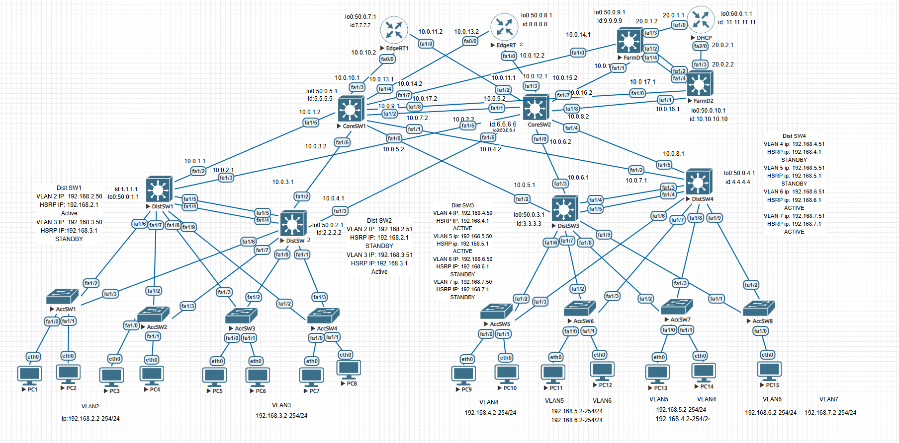

# Monolithic / lab initial setup — Phase 1

A scalable and highly available multi-tier Enterprise Campus Network architecture designed and simulated within **EVE-NG**.  
This repository contains the baseline infrastructure (routing, switching, redundancy, and IP management) for a large-scale corporate network consisting of **19 devices**.

---

##  Network Topology

---

##  Network Architecture (19 Devices)

The infrastructure mimics a real-world enterprise deployment, split into functional layers:

- **DHCP Server (1):** Central IP address management
- **Edge Layer (2):** Perimeter routing and external connectivity
- **Server Farm (2):** Internal corporate services
- **Core Layer (2):** High-speed backbone switching
- **Distribution Layer (4):** Aggregation + HSRP redundancy
- **Access Layer (8):** End-user connectivity

---

##  Phase 1 Features Implemented

- **Hierarchical Topology:** 3-tier design (Core / Distribution / Access)
- **HSRP:** Gateway redundancy on Distribution layer
- **STP:** Loop prevention and optimized paths
- **VLANs & Trunks:** Network segmentation (802.1Q)
- **DHCP:** Centralized IP assignment
- **Inter-VLAN Routing:** Communication between VLANs

---

##  Repository Structure

- `Edge_Routers.txt` — Edge routing configs  
- `Farm_Switches.txt` — Server farm switching  
- `Core_Switches.txt` — Core backbone configs  
- `Distribution_Switches.txt` — HSRP + VLAN routing  
- `Access_Switches.txt` — Access layer templates  
- `DHCP_Router.txt` — DHCP configuration  

---

##  Roadmap (Phase 2)

- NAT/PAT + ACL security
- HSRP failover testing
- VLAN redesign optimization
- Windows Server + AD integration
- Automated configuration backups
